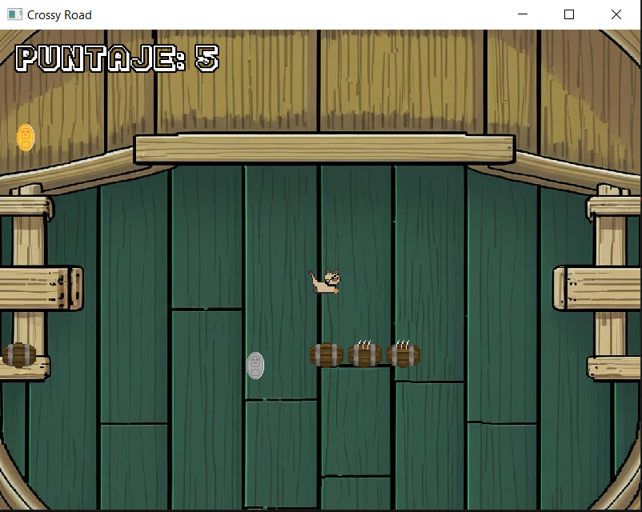
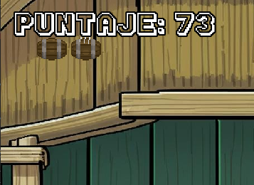
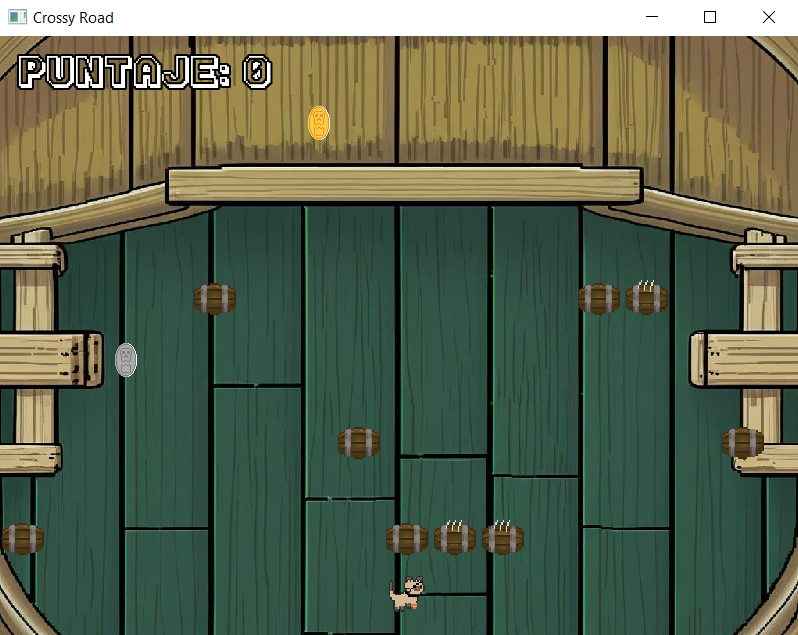
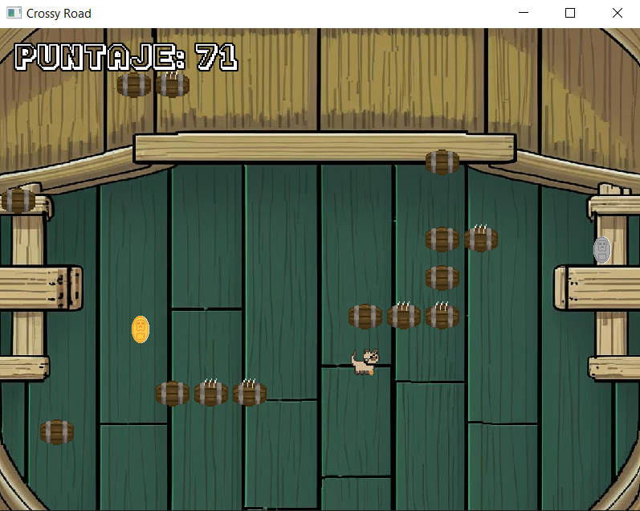

# CatRoad 🐱

**Autores:** Julieta Padilla y Kevin Flores 

[](https://isocpp.org/)
[](https://www.sfml-dev.org/)
[]()

## 📖 Descripción

CatRoad es un videojuego arcade inspirado en el clásico "Crossy Road", donde controlas a un gatito que debe cruzar, llenos de obstáculos, recolectando monedas y sumando puntos. El objetivo es avanzar la mayor cantidad de filas posible, evitando colisiones y superando tu propio récord.

## ✨ Características principales

- 🎮 **Gráficos y sprites animados**: Personaje principal animado y obstáculos visuales.
- 🎲 **Obstáculos aleatorios**: barriles y otros elementos aparecen y se mueven de forma impredecible.
- 💰 **Coleccionables**: Monedas de 5 y 10 puntos aparecen aleatoriamente en el mapa.
- 📊 **Puntaje visible y persistente**: El puntaje se muestra en pantalla y se guarda el récord máximo por usuario.
- 👤 **Registro de usuario**: Cada jugador ingresa su nombre y su récord se almacena individualmente.
- 🎵 **Música de fondo**: Sonido ambiente durante la partida.
- 🏠 **Menú de inicio**: Pantalla de bienvenida, ingreso de nombre y visualización de récord.
- 🖥️ **Compatibilidad multiplataforma**: Funciona en Windows, macOS y Linux (requiere SFML).
---

## 🚀 Instalación y configuración

### Prerequisitos

El proyecto está desarrollado sobre **MinGW64** utilizando **Msys2** y como editor se está utilizando **Visual Studio Code**.

- [Instalar las herramientas necesarias](./docs/herramientas.md)

- [Instalar las Extensiones VSCode](./docs/extensiones.md)

- [Instalar las librerias](./docs/librerias.md)

- [Clonar el repositorio](./docs/fork.md)


### Requisitos del sistema:
  - **SFML 2.x** - [Descargar aquí](https://www.sfml-dev.org/)
  - **Compilador C++** compatible con C++17
  - **Sistema operativo**: Windows, macOS o Linux

### Compilación:
  1. Navega a la carpeta del proyecto en terminal:
   ```bash
   cd CrossyRoad
   ```

2. Compila el proyecto:
   ```bash
   make
   ```

3. Ejecuta el juego:
   ```bash
   make run'NombreEjecutable'
---

## 📷 Capturas del juego

### Funcionamiento del juego

| Jugando            | Sistema de puntaje |
|:------------------:|:------------------:|
|  |  |

### Diferentes momentos del juego

| Inicio del nivel      | Avanzando en el juego |
|:---------------------:|:---------------------:|
|  |  |

> **💡 Nota:** Actualmente el juego se cierra automáticamente al chocar con obstáculos. Una pantalla de Game Over será implementada en futuras versiones.
---

## 🎮 Manual de usuario
### Menú principal

| Pantalla de inicio | Segundo menú |
|:-----------------:|:------------:|
|  |  |

### Navegación del menú

- **Pantalla de bienvenida:**

  - Presiona `Enter` para comenzar o `Esc` para salir.

- **Ingreso de usuario:**

  - Escribe tu nombre y presiona `Enter`.

- **Visualización de récord:**

  - Se muestra tu puntaje máximo anterior antes de iniciar la partida.


### ¿Cómo jugar?

#### Controles
| Tecla | Acción |
|:-----:|:-------|
| `↑` | Mover hacia arriba |
| `↓` | Mover hacia abajo |
| `←` | Mover hacia la izquierda |
| `→` | Mover hacia la derecha |
| `Enter` | Reiniciar (en Game Over) |
| `Esc` | Salir del juego |


#### Objetivo
  1. **Cruza** la mayor cantidad de filas posibles sin chocar con obstáculos
  2. **Recolecta** monedas para aumentar tu puntaje
  3. **Supera** tu récord personal

#### Game Over

  - Si chocas con un obstáculo, se termina el juego.
---
## 🎯 Elementos del juego

### Obstáculos

Barriles que se mueven horizontalmente por las filas.


### Coleccionables
| Moneda | Valor | Imagen |
|:------:|:-----:|:------:|
| Dorada | +5 puntos |  |
| Plateada | +10 puntos |  |

### Sistema de Puntaje
- Se muestra en la **esquina superior izquierda**
- El récord máximo se guarda por usuario en `assets/puntajes/`

---

## 📁 Estructura de carpetas

```
CrossyRoad/
├── assets/          # Recursos del juego
│   ├── images/      # Sprites e imágenes
│   ├── music/       # Música y efectos de sonido
│   ├── fonts/       # Fuentes tipográficas
│   └── puntajes/    # Records de usuarios
├── src/             # Código fuente principal
├── include/         # Archivos de cabecera (.h)
├── bin/             # Ejecutables generados
├── docs/            # Documentación y diagramas
└── Makefile         # Configuración de compilación
```
---

## 📚 Guía rápida de desarrollo de GitHub 

### Clonar el repositorio

1. Copia la URL del repositorio (por ejemplo, desde GitHub).
2. Abre una terminal y ejecuta:
   ```sh
   git clone https://github.com/usuario/CrossyRoad.git
   ```
3. Entra a la carpeta del proyecto:
   ```sh
   cd CrossyRoad
   ```

### Crear tu propio repositorio

1. Crea una cuenta en [GitHub](https://github.com/) si no tienes una.
2. Haz clic en **"New repository"** y sigue los pasos.
3. Para subir tu proyecto local:
   ```sh
   git init
   git add .
   git commit -m "Primer commit"
   git branch -M main
   git remote add origin https://github.com/usuario/tu-repo.git
   git push -u origin main
   ```

### Crear diagramas de clases

1. Puedes usar [PlantUML](https://plantuml.com/) para crear diagramas de clases fácilmente.
2. Ejemplo básico de sintaxis (ver `docs/diagrama.puml`):
   ```plantuml
   @startuml
   class Gatito {
     +moverArriba()
     +moverAbajo()
   }
   class Obstaculo {
     +mover()
   }
   Gatito --> Obstaculo
   @enduml
   ```

> **Tip:** Puedes usar la extensión de PlantUML en VSCode para generar diagramas automáticamente. (Recuerda tener instalado Java para poder visualizarlo)
---

## 🤝 Contribuir

Las contribuciones son bienvenidas. Para contribuir:

1. Haz un **fork** del proyecto
2. Crea una **rama** para tu feature (`git checkout -b feature/AmazingFeature`)
3. **Commit** tus cambios (`git commit -m 'Add some AmazingFeature'`)
4. **Push** a la rama (`git push origin feature/AmazingFeature`)
5. Abre un **Pull Request**
---

## 📄 Licencia y créditos

- **Sprites, música y fuentes** utilizados son para fines educativos
- **Desarrollado por:** Julieta Padilla y Kevin Flores
- **Inspirado en:** Crossy Road (Hipster Whale)
---
## 🎉 ¡Comienza a jugar!

¿Listo para el desafío? ¡Descarga CrossyRoad y supera tu propio récord!

```bash
make run
```

### ¡Disfruta el reto y que tengas suerte cruzando! 🍀

