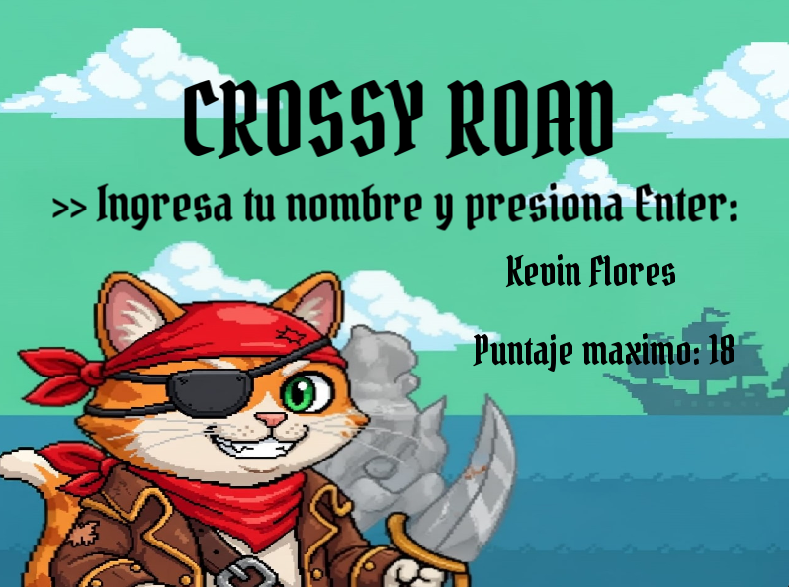

# CrossyRoad

**Autor:** Julieta Padilla y Kevin Flores 

## Descripción

CrossyRoad es un videojuego arcade inspirado en el clásico "Crossy Road", donde controlas a un gatito que debe cruzar, llenos de obstáculos, recolectando monedas y sumando puntos. El objetivo es avanzar la mayor cantidad de filas posible, evitando colisiones y superando tu propio récord.

## Características principales

- **Gráficos y sprites animados**: Personaje principal animado y obstáculos visuales.
- **Obstáculos aleatorios**: barriles y otros elementos aparecen y se mueven de forma impredecible.
- **Coleccionables**: Monedas de 5 y 10 puntos aparecen aleatoriamente en el mapa.
- **Puntaje visible y persistente**: El puntaje se muestra en pantalla y se guarda el récord máximo por usuario.
- **Registro de usuario**: Cada jugador ingresa su nombre y su récord se almacena individualmente.
- **Música de fondo**: Sonido ambiente durante la partida.
- **Menú de inicio**: Pantalla de bienvenida, ingreso de nombre y visualización de récord.
- **Compatibilidad multiplataforma**: Funciona en Windows, macOS y Linux (requiere SFML).

## Prerequisitos

[Instalar las herramientas necesarias](./docs/herramientas.md)

[Instalar las Extensiones VSCode](./docs/extensiones.md)

[Instalar las librerias](./docs/librerias.md)


## Manual de usuario

### Instalación y ejecución
1. **Requisitos:**

   - Tener instalado [SFML 2.x](https://www.sfml-dev.org/)
   - Compilador C++ compatible con C++17

2. **Compilación:**

   - En terminal, navega a la carpeta del proyecto y ejecuta:
     ```sh
     make
     ```
3. **Ejecución:**

Instalar todas las dependencias descritas arriba y dentro de una terminal de vscode ejecutar:

> make run'NombreEjecutable'


### Menú principal




- **Pantalla de bienvenida:**

  - Presiona `Enter` para comenzar o `Esc` para salir.

- **Ingreso de usuario:**

  - Escribe tu nombre y presiona `Enter`.

- **Visualización de récord:**

  - Se muestra tu puntaje máximo anterior antes de iniciar la partida.


### Cómo jugar

- **Movimiento:**

  - Usa las flechas del teclado (`↑`, `↓`, `←`, `→`) para mover al gatito por la cuadrícula.

- **Objetivo:**

  - Cruza la mayor cantidad de filas posibles sin chocar con obstáculos.
  - Recolecta monedas de 5 y 10 puntos para aumentar tu puntaje.

- **Game Over:**

  - Si chocas con un obstáculo, aparece la pantalla de Game Over con opción de reiniciar (`Enter`) o salir (`Esc`).


### Elementos del juego

- **Obstáculos:**

  - Barriles y otros elementos que se mueven horizontalmente por las filas.
  

- **Coleccionables:**

  - Moneda dorada: +5 puntos
  - Moneda plateada: +10 puntos
  
  

- **Puntaje:**

  - Se muestra en la esquina superior izquierda.
  - El récord máximo se guarda por usuario en la carpeta `assets/puntajes/`.


### Estructura de carpetas

- `assets/` - Recursos del juego (imágenes, música, fuentes, puntajes)
- `src/` - Código fuente principal
- `include/` - Archivos de cabecera
- `bin/` - Ejecutables generados
- `docs/` - Diagramas y documentación

## Guía rápida de Git y diagramas

### ¿Cómo clonar un repositorio?

1. Copia la URL del repositorio (por ejemplo, desde GitHub).
2. Abre una terminal y ejecuta:
   ```sh
   git clone https://github.com/usuario/CrossyRoad.git
   ```
3. Entra a la carpeta del proyecto:
   ```sh
   cd CrossyRoad
   ```

### ¿Cómo crear tu propio repositorio?

1. Crea una cuenta en [GitHub](https://github.com/) si no tienes una.
2. Haz clic en "New repository" y sigue los pasos.
3. Para subir tu proyecto local:
   ```sh
   git init
   git add .
   git commit -m "Primer commit"
   git branch -M main
   git remote add origin https://github.com/usuario/tu-repo.git
   git push -u origin main
   ```

### ¿Cómo realizar un diagrama de clases?

1. Puedes usar [PlantUML](https://plantuml.com/) para crear diagramas de clases fácilmente.
2. Ejemplo básico de sintaxis (ver `docs/diagrama.puml`):
   ```plantuml
   @startuml
   class Gatito {
     +moverArriba()
     +moverAbajo()
   }
   class Obstaculo {
     +mover()
   }
   Gatito --> Obstaculo
   @enduml
   ```
3. Para generar la imagen, puedes usar la extensión de PlantUML en VSCode o el sitio web oficial.

### Créditos y licencias

- Sprites, música y fuentes utilizados son para fines educativos.
- Desarrollado por Julieta Padilla.

---
¡Disfruta el reto y supera tu propio récord en CrossyRoad!
